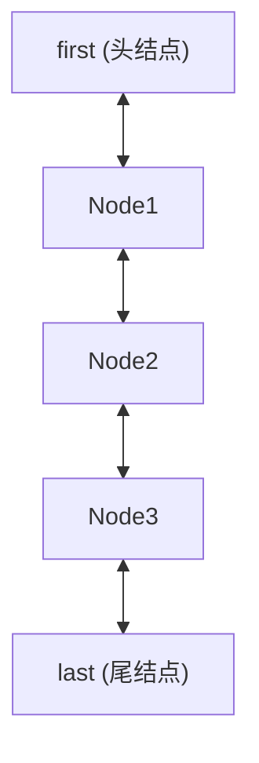

📘 Java 面试复习笔记：LinkedList

---

✅ 一、概念简介  
- LinkedList 是 Java 集合框架中实现 List、Deque、Queue 接口的双向链表结构。  
- 适用于频繁插入、删除操作的场景，如队列、栈、双端队列等。  
- 特性：  
  - 有序、可重复、允许 null 元素  
  - 查询慢（O(n)），增删快（O(1)）  
  - 线程不安全，需手动加锁或用 Collections.synchronizedList 包装  
- 对比：  
  - ArrayList：底层数组，查询快，增删慢，适合随机访问  
  - LinkedList：底层链表，查询慢，增删快，适合频繁插入/删除  
  - Vector：线程安全的 ArrayList，性能较差

---

🔍 二、底层原理 + 源码分析

- 数据结构：  
  - JDK8 及以后，LinkedList 采用双向链表，每个节点（Node）包含前驱、后继和数据  
  - 头尾指针：first、last  
  - size 记录元素个数，modCount 记录结构性修改次数（用于 fail-fast）

- 关键字段（JDK8 源码）：
  ```java
  // 节点定义
  private static class Node<E> {
      E item;           // 当前节点存储的数据
      Node<E> next;     // 后继节点
      Node<E> prev;     // 前驱节点
      Node(Node<E> prev, E element, Node<E> next) {
          this.item = element;
          this.next = next;
          this.prev = prev;
      }
  }
  // 头结点
  transient Node<E> first;
  // 尾结点
  transient Node<E> last;
  // 元素个数
  transient int size = 0;
  // 结构性修改次数
  transient int modCount = 0;
  ```

- 关键方法源码分析（以 add、remove、get 为例）：

  **add(E e)**
  ```java
  public boolean add(E e) {
      linkLast(e); // 始终在链表尾部插入
      return true;
  }
  void linkLast(E e) {
      final Node<E> l = last;
      final Node<E> newNode = new Node<>(l, e, null);
      last = newNode;
      if (l == null)
          first = newNode; // 空链表，头尾都指向新节点
      else
          l.next = newNode; // 原尾节点的 next 指向新节点
      size++;
      modCount++;
  }
  ```

  **remove(int index)**
  ```java
  public E remove(int index) {
      checkElementIndex(index);
      return unlink(node(index));
  }
  E unlink(Node<E> x) {
      final E element = x.item;
      final Node<E> next = x.next;
      final Node<E> prev = x.prev;

      if (prev == null) {
          first = next; // 删除头节点
      } else {
          prev.next = next;
          x.prev = null;
      }
      if (next == null) {
          last = prev; // 删除尾节点
      } else {
          next.prev = prev;
          x.next = null;
      }
      x.item = null; // help GC
      size--;
      modCount++;
      return element;
  }
  ```

  **get(int index)**
  ```java
  public E get(int index) {
      checkElementIndex(index);
      return node(index).item;
  }
  Node<E> node(int index) {
      // 优化：前半段从头遍历，后半段从尾遍历
      if (index < (size >> 1)) {
          Node<E> x = first;
          for (int i = 0; i < index; i++)
              x = x.next;
          return x;
      } else {
          Node<E> x = last;
          for (int i = size - 1; i > index; i--)
              x = x.prev;
          return x;
      }
  }
  ```

---

✅ 三、常用方式 + 代码示例

```java
import java.util.LinkedList;
import java.util.List;

public class LinkedListDemo {
    public static void main(String[] args) {
        // 创建 LinkedList
        List<String> list = new LinkedList<>();
        list.add("A"); // 尾部插入
        list.add("B");
        list.add(1, "C"); // 指定位置插入

        // 遍历
        for (String s : list) {
            System.out.println(s); // 输出每个元素
        }

        // 删除
        list.remove("B"); // 删除指定元素
        list.remove(0);   // 删除指定下标

        // 获取元素
        String first = list.get(0); // 获取第一个元素

        // 作为队列使用
        LinkedList<String> queue = new LinkedList<>();
        queue.offer("X"); // 入队
        String head = queue.poll(); // 出队

        // 作为栈使用
        queue.push("Y"); // 入栈
        String pop = queue.pop(); // 出栈

        // 注意：线程不安全，需手动加锁或用 Collections.synchronizedList 包装
    }
}
```
- 易错点：  
  - get/remove 操作时间复杂度 O(n)，不适合频繁随机访问  
  - 允许 null 元素，但不建议在业务主键场景使用  
  - 线程不安全，需注意并发问题

---

🎯 四、真实面试高频问题 + 深度解析

1.  
  - 题目：LinkedList 和 ArrayList 有什么区别？  
  - 标准答案：底层结构不同，LinkedList 是双向链表，ArrayList 是动态数组。  
  - 详细解析：LinkedList 增删快，查找慢；ArrayList 查找快，增删慢。LinkedList 适合插入/删除多的场景，ArrayList 适合随机访问多的场景。  
  - 陷阱警告：不要只说“一个是链表，一个是数组”，要结合时间复杂度和应用场景。

2.  
  - 题目：LinkedList 的 get(int index) 为什么慢？  
  - 标准答案：因为需要从头或尾遍历链表，时间复杂度 O(n)。  
  - 详细解析：源码 node(index) 方法，前半段从头遍历，后半段从尾遍历，最坏 O(n)。  
  - 陷阱警告：不要误以为 get 是 O(1)。

3.  
  - 题目：LinkedList 如何实现队列和栈？  
  - 标准答案：通过 offer/poll 实现队列，通过 push/pop 实现栈。  
  - 详细解析：LinkedList 实现了 Deque 接口，支持双端队列操作。  
  - 陷阱警告：不要用 add/remove 代替队列/栈方法，易混淆。

4.  
  - 题目：LinkedList 线程安全吗？如何保证线程安全？  
  - 标准答案：线程不安全，可用 Collections.synchronizedList 包装或手动加锁。  
  - 详细解析：源码无同步措施，适合单线程或外部加锁。  
  - 陷阱警告：不要误用在多线程环境。

5.  
  - 题目：LinkedList 内存占用和 ArrayList 有什么不同？  
  - 标准答案：LinkedList 每个节点多了前驱/后继指针，内存占用更高。  
  - 详细解析：每个 Node 对象有 2 个引用，ArrayList 只存数据。  
  - 陷阱警告：不要忽略链表节点的额外开销。

6.  
  - 题目：LinkedList 是否支持快速随机访问？  
  - 标准答案：不支持，get/set 时间复杂度 O(n)。  
  - 详细解析：链表结构决定了只能顺序遍历。  
  - 陷阱警告：不要用 LinkedList 做频繁随机访问。

7.  
  - 题目：LinkedList 如何防止 ConcurrentModificationException？  
  - 标准答案：遍历时不要结构性修改，或用迭代器的 remove 方法。  
  - 详细解析：modCount 机制，fail-fast。  
  - 陷阱警告：不要在 for-each 遍历时直接 remove。

---

💡 五、口诀 + 表格/图示辅助记忆

- 口诀：  
  - “查慢增删快，双向链表占内存；队列栈都能用，线程安全需加锁。”

- 对比表：

| 特性         | ArrayList      | LinkedList      |
| ------------ | -------------- | --------------- |
| 底层结构     | 动态数组       | 双向链表        |
| 查询效率     | O(1)           | O(n)            |
| 增删效率     | O(n)           | O(1)（首尾）    |
| 内存占用     | 较低           | 较高            |
| 线程安全     | 否             | 否              |
| 适用场景     | 随机访问多     | 插入/删除多     |

- 结构图：  


---

🎁 六、建议 + 误区提醒

- 不要用 LinkedList 做频繁随机访问，性能极差。
- 多线程环境下需手动加锁或用同步包装。
- 注意 fail-fast 机制，遍历时结构性修改会抛 ConcurrentModificationException。
- 需要高效并发队列时，优先考虑 ConcurrentLinkedQueue、BlockingQueue 等并发集合。
- 业务主键、索引场景优先用 ArrayList。
- 频繁插入/删除、队列/栈场景优先用 LinkedList。

---

如需深入源码或有具体面试题，欢迎继续提问！
