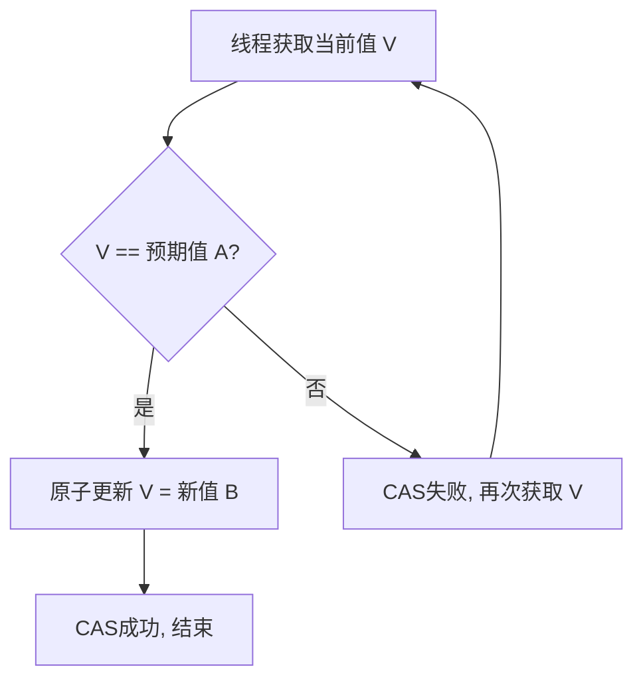

📘 Java 面试复习笔记：CAS (Compare-And-Swap)

✅ 一、概念简介

**是什么？**

CAS，全称 Compare-And-Swap（比较并交换），是计算机体系结构中的一种原子操作，被现代 CPU 广泛支持。它是一种**乐观锁**的实现思想，用于在多线程环境下实现无锁（lock-free）的并发操作。

**核心思想**

CAS 操作包含三个操作数：

1.  **V (Value)**：内存位置的当前值。
2.  **A (Expected)**：预期值。
3.  **B (New)**：将要写入的新值。

CAS 的原子操作逻辑：**如果内存位置 V 的值等于预期值 A，那么就将该位置的值更新为 B。否则，不做任何操作。** 这个“比较并交换”的整个过程是原子的，即要么都成功，要么都失败，不会被打断。

**与悲观锁（synchronized, ReentrantLock）的对比**

| 特性 | CAS (乐观锁) | synchronized/Lock (悲观锁) |
| :--- | :--- | :--- |
| **思想** | 乐观。认为并发冲突的概率很低，不加锁，发生冲突才重试。 | 悲观。认为并发冲突的概率很高，在操作前先加锁，独占资源。 |
| **实现** | 依赖硬件指令，无锁操作。 | 依赖操作系统、JVM 层面，通过阻塞或自旋实现。 |
| **性能** | 高。在低并发场景下性能优越，没有线程切换和阻塞的开销。 | 低。线程阻塞、唤醒会带来上下文切换开销，吞吐量较低。 |
| **冲突处理** | 失败重试。如果更新失败，通常会自旋（多次尝试）或放弃。 | 失败阻塞。线程会进入等待队列，直到获取锁为止。 |
| **适用场景** | 读多写少、冲突少的场景，如计数器。 | 写多读少、冲突多的场景，如复杂的业务逻辑。 |

-----

🔹 二、底层原理 + 源码分析

Java 中 CAS 的核心实现主要依赖于 `Unsafe` 类，这是一个 JDK 内部的非公开 API。`Unsafe` 类提供了 `compareAndSwapInt()`、`compareAndSwapLong()` 等一系列本地方法，这些方法会直接调用 CPU 的 CAS 指令。

**核心字段**

在 `java.util.concurrent.atomic` 包下，所有原子类（如 `AtomicInteger`、`AtomicLong`）都使用 CAS 实现了无锁并发。以 `AtomicInteger` 为例：

```java
public class AtomicInteger extends Number implements java.io.Serializable {
    // Unsafe 类的实例，用于直接操作内存
    private static final Unsafe unsafe = Unsafe.getUnsafe();
    // 成员变量 value 在内存中的偏移量，通过该偏移量可以直接访问变量
    private static final long valueOffset;

    static {
        try {
            // 获取 value 字段在 AtomicInteger 对象中的内存偏移量
            valueOffset = unsafe.objectFieldOffset(AtomicInteger.class.getDeclaredField("value"));
        } catch (Exception ex) { throw new Error(ex); }
    }

    // volatile 关键字保证了可见性，多线程可以读到最新值
    private volatile int value;
    
    // ...
}
```

  * `Unsafe`：提供了直接访问内存、操作线程、CAS 等底层能力，是 Java 并发包的基石。
  * `valueOffset`：记录了 `value` 字段在对象内存中的位置。`Unsafe` 类正是通过这个偏移量来定位并修改变量的。
  * `volatile int value`：`volatile` 关键字在这里至关重要，它保证了 `value` 变量在多线程间的**可见性**。一个线程对 `value` 的修改能立即被其他线程看到。这是实现 CAS 的前提，否则即使 CAS 成功，其他线程也可能读到旧值。

**源码分析 - `AtomicInteger.getAndIncrement()`**

这个方法实现了自增操作的原子性。它不是简单的 `value++`，而是通过循环和 CAS 来保证线程安全。

```java
public final int getAndIncrement() {
    return unsafe.getAndAddInt(this, valueOffset, 1);
}

// Unsafe.java（伪代码，为便于理解）
public final int getAndAddInt(Object o, long offset, int delta) {
    int v;
    do {
        // 1. 获取当前内存中的值，v = 预期值 A
        v = getIntVolatile(o, offset); 
        // 2. 尝试使用 CAS 替换，
        //    预期值 A = v，新值 B = v + delta
        //    如果 CAS 失败（当前值 != v），则继续循环重试
    } while (!compareAndSwapInt(o, offset, v, v + delta));
    return v; // 返回旧值
}
```

**执行流程：**

1.  **获取当前值**：线程 A 获取 `value` 的当前值 `v`，作为它的“预期值”。
2.  **计算新值**：线程 A 计算出新值 `v + 1`。
3.  **CAS 尝试**：线程 A 调用 `compareAndSwapInt(o, offset, v, v+1)`，检查当前 `value` 是否仍等于 `v`。
      * **如果相等**：说明没有其他线程修改过 `value`，CAS 成功，`value` 被原子地更新为 `v + 1`，循环结束。
      * **如果不相等**：说明在线程 A 计算期间，`value` 已经被其他线程修改了。CAS 失败，`compareAndSwapInt` 返回 `false`。
4.  **循环重试**：由于 CAS 失败，`while` 循环继续执行，线程 A 重新回到第 1 步，再次获取最新的 `value` 值，并重复尝试，直到成功为止。

这种“自旋（spin）”+ CAS 的模式，是无锁并发的典型实现。

-----

✅ 三、常用方式 + 代码示例

`java.util.concurrent.atomic` 包下的原子类是 CAS 在 Java 中最常见的应用。

**1. `AtomicInteger` 线程安全计数器**

```java
import java.util.concurrent.atomic.AtomicInteger;

public class AtomicCounter {
    // 使用 AtomicInteger 替代 volatile int，保证操作的原子性
    private AtomicInteger count = new AtomicInteger(0);

    public void increment() {
        // 原子自增，等同于 count.getAndIncrement()
        count.incrementAndGet();
    }

    public int getCount() {
        return count.get();
    }

    public static void main(String[] args) throws InterruptedException {
        AtomicCounter counter = new AtomicCounter();
        Thread[] threads = new Thread[10];
        for (int i = 0; i < 10; i++) {
            threads[i] = new Thread(() -> {
                for (int j = 0; j < 1000; j++) {
                    counter.increment();
                }
            });
            threads[i].start();
        }

        for (Thread t : threads) {
            t.join(); // 等待所有线程执行完毕
        }
        System.out.println("Final count: " + counter.getCount());
        // 最终输出结果必然是 10000，这是线程安全的
    }
}
```

**注释：** 如果将 `AtomicInteger count` 替换为 `volatile int count`，并执行 `count++` 操作，最终结果将不是 10000。因为 `count++` 实际上是“读取-修改-写入”三个非原子操作的组合，存在竞态条件。而 `AtomicInteger` 通过 CAS 保证了这三步的原子性。

-----

🎯 四、真实面试高频问题 + 深度解析

**1. CAS 是什么？它和 synchronized 有什么区别？**

  * **标准答案：** CAS 是一种乐观锁机制，通过比较并交换的原子操作实现无锁并发。`synchronized` 是悲观锁，通过锁独占资源。主要区别在于冲突处理和性能。
  * **详细解析：** 悲观锁的线程在获取不到锁时会阻塞，导致上下文切换，开销大；乐观锁（CAS）通过自旋重试，没有线程阻塞，在低并发时性能优越。但高并发时，CAS 自旋会消耗大量 CPU 资源。
  * **陷阱警告：** 仅仅说 CAS 是乐观锁是不够的，面试官会期望你深入解释其工作原理，以及与悲观锁在性能和使用场景上的具体差异。

**2. CAS 的三大问题是什么？如何解决？**

  * **标准答案：** 1. ABA 问题；2. 循环开销大；3. 只能保证一个共享变量的原子操作。
  * **详细解析：**
    1.  **ABA 问题：** 线程 A 读取 V 的值为 A，准备修改为 C。在此期间，线程 B 将 V 修改为 B，然后又改回了 A。线程 A 检查时发现 V 仍然是 A，CAS 成功。但实际上该值已经被其他线程操作过了。
          * **解决方案：** 引入版本号（或时间戳）。`AtomicStampedReference` 类正是利用此原理，在 CAS 比较时，不仅比较值，还比较版本号。
    2.  **循环开销大：** 在高并发场景下，多个线程反复自旋尝试 CAS，会消耗大量的 CPU 资源。
          * **解决方案：** \* 在循环中加入 `Thread.yield()` 或 `Thread.sleep()` 适当让出 CPU。
              * 对于高并发场景，悲观锁可能更合适。
    3.  **只能保证一个共享变量的原子操作：** `Unsafe` 的 `compareAndSwap` 系列方法只能针对一个变量进行操作。
          * **解决方案：** \* 将多个变量封装成一个对象，使用 `AtomicReference` 来保证这个对象的引用地址的原子性。
              * 使用 `AtomicReferenceFieldUpdater` 对对象的某个字段进行原子操作。
              * 使用 `synchronized` 或 `Lock` 来保证多个变量操作的原子性。
  * **陷阱警告：** 面试官会重点考察你对 ABA 问题的理解和解决方案，这是 CAS 理论的经典考点。

**3. 为什么 CAS 需要配合 volatile 关键字使用？**

  * **标准答案：** CAS 保证的是操作的原子性，但不能保证变量的可见性。`volatile` 保证了共享变量在多线程间的可见性。
  * **详细解析：**
      * **可见性：** `volatile` 确保当一个线程修改了变量的值，新值能立即同步到主内存，并且让其他线程的缓存失效，从而能读取到最新值。
      * **CAS 过程：** `AtomicInteger` 的 `getAndAddInt()` 方法在 `do...while` 循环中，每次循环都会先 `getIntVolatile()` 来获取最新的值。如果这个值不是 `volatile` 变量，线程可能从自己的本地缓存中读取到旧值，导致 CAS 操作永远无法成功。
  * **陷阱警告：** 很多初学者只知道 CAS 是原子操作，但忽略了 `volatile` 在其背后所起到的“桥梁”作用，即确保操作的数据始终是最新、最准确的。

-----

💡 五、口诀 + 表格/图示辅助记忆

**CAS 三大问题口诀**

> **A-B-A，多变一。**
> **自旋忙，耗 CPU。**
> **单变量，难同步。**

**CAS 流程图**



-----

🎁 六、建议 + 误区提醒

**误区提醒**

1.  **CAS 是万能的：** 不要认为 CAS 可以替代所有锁。在高并发、竞争激烈的场景下，CAS 自旋会成为性能瓶颈，此时使用 `synchronized` 或 `ReentrantLock` 可能会是更好的选择，因为它们可以让线程进入休眠，从而释放 CPU。
2.  **`volatile` 就能实现原子性：** `volatile` 只能保证可见性，不能保证复合操作的原子性（如 `i++`）。要实现原子操作，必须使用 CAS 或锁。

**使用建议**

1.  **优先使用原子类：** 在需要对单个变量进行原子操作时，优先考虑 `java.util.concurrent.atomic` 包下的类，如 `AtomicInteger`、`AtomicLong`、`AtomicBoolean`。它们内部已经封装了 CAS 逻辑，使用简单且高效。
2.  **理解场景：**
      * **低并发、读多写少：** CAS 性能更优。
      * **高并发、写多读少：** 锁机制可能更合适，因为可以减少 CPU 自旋开销。
3.  **自定义 CAS 逻辑：** 在需要对复杂对象或多个变量进行原子更新时，可以考虑使用 `AtomicStampedReference` 或自己实现自旋 + CAS 的逻辑，但要确保对并发问题有深刻理解。